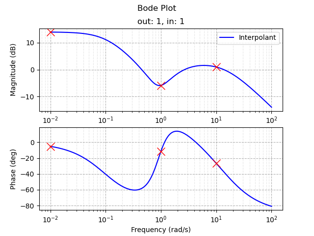

# The Loewner Framework, in Python!

A Python/NumPy implementation of the Loewner framework for data-driven rational interpolation of complex-valued data and dynamical systems.

Jump to a section

[Contributing](#contributing)

[Background (Explanation & Some Theory)](#background-explanation--some-theory)

[Getting Started With This Module](#getting-started-with-this-module)

[Implementation Specifics](#implementation-specifics)

[Some Sources](#some-sources)

[Data Model](#data-model)


It doesn't take much to start building interpolants.
```
import numpy as np
import loewner_framework as lf
import loewner_framework.linear_daes as ld

Lambda = np.diag([0.0, complex(imag=1.0), complex(imag=-1.0)])
R = np.array([[1, 1, 1]])
W = np.array([[complex(real=5.0), complex(real=0.5, imag=-0.1), complex(real=0.5, imag=0.1)]])
rtd = lf.RightTangentialData(Lambda, R, W)

M = np.diag([1.0, complex(imag=10.0), complex(imag=-10.0)])
L = np.array([  [1],
                [1],
                [1]])
V = np.array([  [1],
                [complex(real=1.0, imag=-0.5)],
                [complex(real=1.0, imag=0.5)]])
ltd = lf.LeftTangentialData(M, L, V)

loewnertd = lf.LoewnerTangentialData(rtd, ltd)
interpolant_builder = lf.InterpolantFactory(loewnertd)
interpolant = interpolant_builder.minimal_order(label="Interpolant")
```
And you can easily view the results on a Bode plot.
```
bode_plot = ld.BodePlot()
bode_plot.add_system(interpolant, color='b')

bode_plot.add_data_tick(at_frequency=10**-2, pin_to_system_num=0, pin_to_output_num=1, pin_to_input_num=1, markersize=12, color="red")
bode_plot.add_data_tick(at_frequency=10**0, pin_to_system_num=0, pin_to_output_num=1, pin_to_input_num=1, markersize=12, color="red")
bode_plot.add_data_tick(at_frequency=10**1, pin_to_system_num=0, pin_to_output_num=1, pin_to_input_num=1, markersize=12, color="red")

bode_plot.show(w_start=-2, w_end=2, w_num_points=10000)
```




The "interpolant" is returned as a generalized state-space / DAE model in the form of a LinearDAE object, with matrices $E$, $A$, $B$, $C$, $D$.
```
interpolant.E, interpolant.A, interpolant.B, interpolant.C, interpolant.D
```
The actual rational function that interpolates the right and left tangential data sets is the transfer function of the LinearDAE object, $$H(s) = C (s E - A)^{-1} B + D.$$

This transfer function can be evaluated directly, *e.g.*
```
interpolant.tf(complex(real=0.0, imag=1.0))
```
The result is a numpy.ndarray of dimension 2. This is maintained even for SISO systems with a scalar transfer function for the purposes of compatibility with MIMO systems having matrix transfer functions.


# Contributing

See a mistake? Have a feature request? Want to contribute?

Submit an issue, or reach out to [joeldsimard@gmail.com](mailto:joeldsimard@gmail.com).


# Background (Explanation & Some Theory)

The background exposition in this section has been paraphrased from the PhD dissertation [J. Simard, Interpolation and model reduction of nonlinear systems in the Loewner framework. Diss. Imperial College London, 2023](https://doi.org/10.25560/104888).

For further details and specific references, see the [Some Sources](#some-sources) section. You can also check out the [MOR Wiki](https://morwiki.mpi-magdeburg.mpg.de/morwiki/index.php/Loewner_Framework) which covers some basic concepts, however this page is somewhat out of date.

## What is the Loewner Framework?

The objective of the rational interpolation problem for linear time-invariant (LTI) systems is to construct an internal or external description of a system the transfer matrix of which is consistent with finite sets of tangential data in the complex plane, and the generalized realization problem for LTI systems entails the construction of a minimal state-space model of a system given the transfer matrix of the system.

The Loewner framework was developed as a toolset used for the solution of the rational interpolation problem and the generalized realization problem for LTI DAEs.

The core object of the Loewner framework is the Loewner matrix, a divided-difference matrix constructed from two sets of points in the complex plane: the right tangential data and the left tangential data. The sets of tangential data are obtained by sampling, along particular directions, a rational matrix function evaluated at particular points in the complex plane. The Loewner matrix has a fine structure that allows its factorization into the tangential generalized controllability and observability matrices. Once obtained, the tangential generalized controllability and observability matrices can be used to construct LTI descriptor system realizations interpolating the sets of tangential data.

### Systems of Differential-Algebraic Equations (DAEs)

While the Loewner framework can be interpreted entirely from the complex rational interpolation point of view, it is both convenient and useful to consider the dynamical systems perspective. In particular, we deal with LTI DAEs of the form

$$E \dot{x} = A x + B u, \quad y = C x + D u,$$

with generalized state $x(t) \in \mathbb{C}^n$, input $u(t) \in \mathbb{C}^m$, and output $y(t) \in \mathbb{C}^p$, and matrices $E \in \mathbb{C}^{n \times n}$, $A \in \mathbb{C}^{n \times n}$, $B \in \mathbb{C}^{n \times m}$, $C \in \mathbb{C}^{p \times n}$, and $D \in \mathbb{C}^{p \times m}$. If such a DAE is regular (uniquely solvable for consistent initial conditions), then it has a transfer function given by

$$H(s) = C (s E - A)^{-1} B + D.$$

The purpose of the Loewner framework is to determine a DAE of this form such that its transfer function interpolates sets of right and left tangential interpolation data. Therefore, if one just wants to get a rational function that interpolates sets of complex data we can simply build the DAE in the Loewner framework and then retrieve its transfer function.

### Tangential Data

Tangential data consist of two disjoint sets of data: the right tangential interpolation data, and the left tangential interpolation data. The right tangential interpolation data are represented by the set

$$\\{(\lambda_i, r_i, w_i) \ | \ \lambda_i \in \mathbb{C}, \ r_i \in \mathbb{C}^m, \ w_i \in \mathbb{C}^p, \ i = 1, \ldots, \rho \\},$$

and the left tangential interpolation data are represented by the set

$$\\{(\mu_j, \ell_j, v_j) \ | \ \mu_j \in \mathbb{C}, \ \ell_j^* \in \mathbb{C}^p, \ v_j^* \in \mathbb{C}^m, \ j = 1, \ldots, \nu \\}.$$


These data sets act as the interpolation constraints for the DAE that will be produced by the Loewner framework. Basically, the transfer function of the DAE will simultaneously satisfy

$$H(\lambda_i) r_i = w_i, \quad i = 1, \ldots, \rho,$$

and

$$\ell_j H(\mu_j) = v_j, \quad j = 1, \ldots, \nu.$$


For the systems perspective we represent the data via right tangential data matrices

$$\Lambda = \text{diag}\begin{bmatrix} \lambda_1, & \ldots, & \lambda_{\rho} \end{bmatrix} \in \mathbb{C}^{\rho \times \rho}, \quad R = \begin{bmatrix} r_1, & \ldots, & r_{\rho} \end{bmatrix} \in \mathbb{C}^{m \times \rho}, \quad W = \begin{bmatrix} w_1, & \ldots, & w_{\rho} \end{bmatrix} \in \mathbb{C}^{p \times \rho},$$

and the left tangential data matrices $\mu$ $\ell$ $w^*$

$$M = \text{diag}\begin{bmatrix} \mu_1, & \ldots, & \mu_{\nu} \end{bmatrix} \in \mathbb{C}^{\nu \times \nu}, \quad L = \begin{bmatrix} \ell_1^{\top}, & \ldots, & \ell_{\nu}^{\top} \end{bmatrix}^{\top} \in \mathbb{C}^{\nu \times p}, \quad V = \begin{bmatrix} v_1^{\top}, & \ldots, & v_{\nu}^{\top} \end{bmatrix}^{\top} \in \mathbb{C}^{\nu \times m}.$$


To ensure the existence of a unique Loewner matrix associated to the data matrices, it is required that the matrices $\Lambda$ and $M$ do not share any eigenvalues.

You can also construct real-valued equivalent data matrices for the purpose of building rational interpolants with real-valued coefficients, however this is not yet discussed here.

### Loewner Matrices

The primary tools used to accomplish the interpolation objective in the Loewner framework are the Loewner matrix, $\mathbb{L}$, and the shifted Loewner matrix, $\sigma \mathbb{L}$. These can be built entry-wise in terms of the tangential interpolation data via

$$\mathbb{L}\_{j,i} = \frac{v_j r_i - \ell_j w_i}{\mu_j - \lambda_i}, \quad \sigma \mathbb{L}\_{j,i} = \frac{\mu_j v_j r_i - \lambda_i \ell_j w_i}{\mu_j - \lambda_i},$$

for rows $j = 1, \ldots, \nu$, and columns $i = 1, \ldots, \rho$.

The matrices are also obtained as the solutions to Sylvester equations,

$$\mathbb{L} \Lambda - M \mathbb{L} = L W - V R, \quad \sigma \mathbb{L} \Lambda - M \sigma \mathbb{L} = L W \Lambda - M V R,$$

which is the preferred method of construction when using low-dimensional equivalent real-valued tangential data matrices.

These matrices satisfy $\sigma \mathbb{L} - \mathbb{L} \Lambda = V R$ and $\sigma \mathbb{L} - M \mathbb{L} = L W$.

There are some additional matrices and relationships associated to the systems perspective, such as the tangential generalized controllability and observability matrices, however these are not yet discussed here. The module builds and utilizes these objects, however it is not required for the user to deal with them.

### A Minimal-Order Family of Interpolants For a Square Loewner Matrix

If the number of right tangential interpolation points is equal to the number of left tangential interpolation points, *i.e.* $\rho = \nu$, if the
Loewner matrices, $\mathbb{L}$ and $\sigma \mathbb{L}$, and the tangential data matrices, $W$ and $V$, are known, and if the matrix pencil $s \mathbb{L} - \sigma \mathbb{L}$ has full rank for all $s \in \sigma(\Lambda) \cup \sigma(M)$, then a system that interpolates the tangential interpolation data can be given by the system of differential-algebraic equations

$$\mathbb{L} \dot{\omega} = \sigma \mathbb{L} \omega - V u,$$

$$\overline{y} = W \omega,$$

which has the transfer function

$$\overline{H}(s) = - W \left( s \mathbb{L} - \sigma \mathbb{L} \right)^{-1} V.$$

This is not very flexible as there are no degrees of freedom in the model to further influence its properties beyond achieving interpolation.


A feedforward term can be leveraged to provide a family of differential-algebraic interpolants matching the tangential data. So long as it is regular, then for any choice of matrix $\overline{D}$ the system

$$\mathbb{L} \dot{\omega} = (\sigma \mathbb{L} - L \overline{D} R) \omega - (V - L \overline{D}) u,$$

$$\overline{y} = (W - \overline{D} R) \omega + \overline{D} u,$$

with transfer function

$$\overline{H}(s) = - (W - \overline{D} R) \left( s \mathbb{L} - (\sigma \mathbb{L} - L \overline{D} R) \right)^{-1} (V - L \overline{D}) + \overline{D},$$

interpolates the tangential interpolation data. Since the matrix $\overline{D}$ is free, it can be used to assign additional properties, *e.g.* stability of the model.

### The Parameterized Family of All Interpolants For Any Dimension

The most general scenario for interpolant construction also considers Loewner matrices that don't have to be square, and interpolants that are allowed to have dimension greater than or equal to $\max\\{\rho, \nu\\}$. For any selections of $\overline{D}$, $P$, $Q$, $G$, $T$, $H$, and $F$ having compatible sizes (making a "square" system), and such that the system is regular, the following DAE

$$\begin{bmatrix} \mathbb{L} & Q \\\ P & G \end{bmatrix} \begin{bmatrix} \dot{\omega} \\\ \dot{\gamma} \end{bmatrix} = \begin{bmatrix} \sigma \mathbb{L} - L \overline{D} R & M Q + L H \\\ P \Lambda + T R & F \end{bmatrix} \begin{bmatrix} \omega \\\ \gamma \end{bmatrix} - \begin{bmatrix} V - L \overline{D} \\\ T \end{bmatrix} u,$$

$$\overline{y} = \begin{bmatrix} W - \overline{D} R & H \end{bmatrix} \begin{bmatrix} \omega \\\ \gamma \end{bmatrix} + \overline{D} u,$$

with transfer function

$$\overline{H}(s) = -\begin{bmatrix} W - \overline{D} R & H \end{bmatrix} \left(s \begin{bmatrix} \mathbb{L} & Q \\\ P & G \end{bmatrix} - \begin{bmatrix} \sigma \mathbb{L} - L \overline{D} R & M Q + L H \\\ P \Lambda + T R & F \end{bmatrix} \right)^{-1} \begin{bmatrix} V - L \overline{D} \\\ T \end{bmatrix} + \overline{D},$$

is an interpolant of the tangential interpolation data.

For any desired system dimension, the matrices $\overline{D}$, $P$, $Q$, $G$, $T$, $H$, and $F$ provide additional free parameters, which allows equiping an interpolant with additional desired properties, and also allows constructing interpolants in the absence of any strict conditions on the Loewner objects. The total dimension of the interpolant can be chosen ever-larger by increasing the sizes of $P$, $Q$, $G$, $T$, $H$, and $F$ if additional free parameters are wanted, however the free parameters should always have compatible shapes such that the model is "square".

Furthermore, for any dimension greater than or equal to $\max\\{\rho, \nu\\}$ this family characterizes all possible systems of that dimension achieving interpolation. Therefore, so long as there is no redundant data, this family is the most general characterization possible and contains every system that can possibly match the data. If it is not possible to find a system with additional desired properties via selections of the parameters $P$, $Q$, $G$, $T$, $H$, $F$, and $\overline{D}$, then a system with those additional desired properties cannot exist.


# Getting Started With This Module

This section describes the details about some of the options provided for building interpolants in this module. The subsections are presented in order based upon the actual construction of an interpolant, with later subsections depending on those that come before.

## Creating Right and Left Tangential Data Sets

To set up the tangential interpolation data sets, we instantiate RightTangentialData and LeftTangentialData objects. The constructors of these classes must be provided the data points in some form. The matrices $\Lambda$ and $R$ must always be provided as numpy.ndarray with dimension two. The matrix $W$ can be directly provided as a numpy.ndarray with dimension two, or can be provided indirectly as a LinearDAE object whose transfer function will be used by the class constructor to generate the $W$ matrix.

### From Complex Data Points (Classical Perspective)

To build the right and left data sets directly from frequency data we can prepare lists of complex points for the right tangential data set
```
lambda_f = [0.1*j, 10.0*j, 1000.0*j]

r_f = [[1, 1, 1]]

w_f = [[2, -1, 0.25]]
```
and for the left tangential data set
```
mu_f = [0.0, 1.0*j, 100.0*j]

ell_f = [   [1],
            [1],
            [1]]

v_f = [ [-0.1],
        [-2],
        [0.5]]
```
These lists are used to prepare numpy.ndarrays with dimension two and then provided to the RightTangentialData and LeftTangentialData class constructors. This is done via
```
Lambda = np.diag(lambda_f)
R = np.array(r_f)
W = np.array(w_f)

rtd = lf.RightTangentialData(Lambda, R, W)
```
and
```
M = np.diag(mu_f)
L = np.array(ell_f)
V = np.array(v_f)

ltd = lf.LeftTangentialData(M, L, V)
```

### From Real-Valued Equivalent Data Matrices

To use equivalent real-valued data matrices we can directly define the numpy.ndarrays via
```
Lambda = np.array([ [0, 0, 0],
                    [0, 0, 1],
                    [0, -1, 0]])

R = np.array([[1, 1, 0]])

W = np.array([[1, 2, 1]])

rtd = lf.RightTangentialData(Lambda, R, W)
```
and
```
M = np.array([  [1, 0, 0],
                [0, 0, -100],
                [0, 100, 0]])

L = np.array([  [1],
                [0],
                [1]])

V = np.array([  [-2],
                [-1],
                [-1]])

ltd = lf.LeftTangentialData(M, L, V)
```


### From a Data Generating System (Systems Perspective)

Instead of providing the tangential data matrices $W$ and $V$ directly, we can provide a system in the form of a LinearDAE object that will be used to generate the data in the constructors. We start by defining a system
```
n, m, p = 10, 1, 1
E = np.eye(n)
A = np.random.random_sample((n,n))
B = np.random.random_sample((n,m))
C = np.random.random_sample((p,n))
D = np.random.random_sample((p,m))
system = ld.LinearDAE(A, B, C, D, label="System")
```
We set the frequencies and tangential directions to evaluate this system's transfer function at (in equivalent real-valued matrix form) via
```
Lambda = np.array([ [0, 0, 0],
                    [0, 0, 1],
                    [0, -1, 0]])

R = np.array([[1, 1, 0]])
```
and
```
M = np.array([  [1, 0, 0],
                [0, 0, -100],
                [0, 100, 0]])

L = np.array([  [1],
                [0],
                [1]])
```
Finally, we provide the LinearDAE object to the constructors in place of the $W$ and $V$ matrices.
```
rtd = lf.RightTangentialData(Lambda, R, system)
ltd = lf.LeftTangentialData(M, L, system)
```

When a system is used to generate the data, you can retrieve the associated tangential generalized controllability and observability matrices
```
rtd.X
ltd.Y
```
If $W$ and $V$ were provided directly these matrices do not exist.

### Checking the Data is Complete, & How it Was Obtained

To check that the RightTangentialData and LeftTangentialData objects contain data this is useable for interpolation, check the isComplete property
```
rtd.isComplete
>>> True (if data is valid), False (if data is not valid)

ltd.isComplete
>>> True (if data is valid), False (if data is not valid)
```

You can retrieve all the data matrices via system properties
```
rtd.Lambda, rtd.R, rtd.W
ltd.M, ltd.L, ltd.V
```

To guarantee that the Loewner matrices can be generated, we need that both data sets are valid (isComplete == True). In addition we need that $\Lambda$ and $M$ don't share any eigenvalues, however because the RightTangentialData and LeftTangentialData objects are independent they cannot verify this property.

To see if the RightTangentialData and LeftTangentialData objects were generated using an underlying system, check the isFromSystem property
```
rtd.isFromSystem
>>> True (if from LinearDAE), False (if from matrix W)

ltd.isFromSystem
>>> True (if from LinearDAE), False (if from matrix W)
```
This ensures that the $X$ and $Y$ matrices can be retrieved from the objects.


## Deriving a Loewner Data Set From the Right and Left Tangential Data Sets

To get the Loewner and shifted Loewner matrices we instantiate a LoewnerTangentialData object. The constructor must be provided with valid RightTangentialData and LeftTangentialData objects (isComplete being True for both). The associated $\Lambda$ and $M$ matrices should also not share any eigenvalues to ensure existence of a unique Loewner matrix
```
loewnertd = lf.LoewnerTangentialData(rtd, ltd)
```

The isFromSystem property is True only if both the RightTangentialData and LeftTangentialData isFromSystem properties are True
```
loewnertd.isFromSystem
>>> True (if from LinearDAE), False (if from matrix W)
```

### Checking the Data is Complete

To ensure that unique Loewner and shifted Loewner matrices were successfully determined, check the isComplete property.
```
loewnertd.isComplete
>>> True (if data is valid), False (if data is not valid)
```
If this property is True, then we can use this data to start building interpolants.

You can retrieve the Loewner and shifted Loewner matrices via properties
```
loewnertd.Loewner, loewnertd.shiftedLoewner
```

## Initializing an "Interpolant Factory" From the Loewner Data Set

To build interpolants, initialize an InterpolantFactory object. The constructor must be provided a LoewnerTangentialData object with the isComplete property being True
```
interpolant_builder = lf.InterpolantFactory(loewnertd)
```

### Checking the Object is Initialized

If the isComplete property of the LoewnerTangentialData object is True, then all should be good. But this can be further checked via the InterpolantFactory object
```
interpolant_builder.isComplete
```

## Generating Interpolants with the Interpolant Factory - Minimal-Order & Square Loewner Matrix

If the Loewner matrix is square we can build interpolants of [minimal order without feedforward term](#a-minimal-order-family-of-interpolants-for-a-square-loewner-matrix)
```
interp1 = interpolant_builder.minimal_order(label="Interpolant Without Feedforward")
```
We can also provide a [feedforward term to get different models of minimal dimension](#a-minimal-order-family-of-interpolants-for-a-square-loewner-matrix)
```
D = np.random.random_sample((interpolant_builder.p, interpolant_builder.m))
interp2 = interpolant_builder.minimal_order(D, label="Interpolant With Feedforward")
```

The returned objects are LinearDAE objects, so their state-space matrices can be retrieved from properties, and the interpolating transfer function can be constructed or evaluated
```
interp1.E, interp1.A, interp1.B, interp1.C, interp1.D
interp1.tf(complex(real=0.0, imag=1.0))
```

## Generating Interpolants with the Interpolant Factory - In General!

To generate [interpolants more generally](#the-parameterized-family-of-all-interpolants-for-any-dimension) (with non-square Loewner matrices and/or non-minimal dimension) we must provided free parameters $\overline{D}$, $P$, $Q$, $G$, $T$, $H$, and $F$ of precisely the right shapes. Some tools are provided so that this can be done easily.

### Getting Required Free Parameter Shapes for a Desired Interpolant Dimension

We can get a dictionary containing the parameter shapes required to produce an interpolant of a desired dimension using the InterpolantFactory's parameter_dimensions method
```
desired_dimension = max(interpolant_builder.nu, interpolant_builder.rho) + 1
dimension_possible, shapes_dict: tuple[bool,dict] = interpolant_builder.parameter_dimensions(desired_dimension)
```

Due to returned dictionary format, if the desired interpolant dimension is possible to achieve then we can generate random free parameter matrices of exactly the correct sizes (or set them to None if not usable) using the following idiom:
```
if dimension_possible:
    params_dict = { "D": np.random.random_sample(shapes_dict["D"]) if shapes_dict["D"] else None,
                    "P": np.random.random_sample(shapes_dict["P"]) if shapes_dict["P"] else None,
                    "Q": np.random.random_sample(shapes_dict["Q"]) if shapes_dict["Q"] else None,
                    "G": np.random.random_sample(shapes_dict["G"]) if shapes_dict["G"] else None,
                    "T": np.random.random_sample(shapes_dict["T"]) if shapes_dict["T"] else None,
                    "H": np.random.random_sample(shapes_dict["H"]) if shapes_dict["H"] else None,
                    "F": np.random.random_sample(shapes_dict["F"]) if shapes_dict["F"] else None}
```

### Verifying That a Selection of Free Parameters has Consistent Shapes

We can also check that some set of free parameters can be used to generate an interpolant using the InterpolantFactory's check_consistent_shapes method
```
parameters_consistent, associated_dimension: tuple[bool,int] = interpolant_builder.check_consistent_shapes(**params_dict)
```
This also determines the dimension of the interpolant associated to the provided free parameters, if the interpolant is possible.

Note that if everything is as expected, then we should also have
```
associated_dimension == desired_dimension
>>> True
```
The reason this may not be be true is because when generating an interpolant of minimal-order with the parameterization method for a square Loewner matrix it is possible to pass a valid parameter dictionary where each value in params_dict is equal to None (and the D matrix is interpreted to be zeros), however the parameter_dimensions method (used beforehand) will return a shapes dictionary with all values equal to None when the desired dimension is not possible. Whenever a desired dimension is possible, the value in the shapes dictionary associated to the D key will not be None. Hence, to avoid this issue we can check one of the following conditionals:
```
associated_dimension == desired_dimension
```
or
```
not shapes_dict["D"] is None
```
or
```
dimension_possible and parameters_consistent
```

### Generating the Interpolant From Consistently-Shaped Free Parameters

Finally, once we are sure that the free parameters $\overline{D}$, $P$, $Q$, $G$, $T$, $H$, and $F$ are consistent we can provide them to the InterpolantFactory's parameterization method to get a LinearDAE object whose transfer function interpolates the tangential interpolation data
```
if dimension_possible and parameters_consistent:
    interp: ld.LinearDAE = interpolant_builder.parameterization(**params_dict, label="Interpolant")
```

Just like using the minimal_order method, we can retrieve the state-space matrices and reconstruct or evaluate the interpolation rational transfer function
```
interp.E, interp.A, interp.B, interp.C, interp.D
interp.tf(complex(real=0.0, imag=1.0))
```


# Implementation Specifics

## The generalized-sylvester & py-linear-DAEs Modules

This module is built on top of the modules [generalized-sylvester](https://github.com/jdsimard/generalized-sylvester) and [py-linear-DAEs](https://github.com/jdsimard/py-linear-DAEs). There is no need to import them, they are built-in; however the documentation for these modules may be useful for using the LinearDAE class, the BodePlot class, and the generalized_sylvester.solve function.

## The Generalized Sylvester Equation Approach vs. The Entry-Wise Construction Approach

Currently the Loewner objects are determined via solving generalized Sylvester equations. This allows for the easy construction of real-valued interpolants as the equivalent real-valued matrices can be used directly in the generalized Sylvester equation approach. However, using real-valued data matrices directly means that we can't build the Loewner matrices entry-wise; this would require transforming to a "diagonalized" classical complex data representation, which can be done but is not yet implemented here. The generalized Sylvester equation approach doesn't scale as well as the entry-wise approach as the quantity of data increases, so for very large amounts of data or very large systems the current approach may be slow or use a large amount of memory. **The entry-wise approach will be added eventually**, along with **functionality for converting between classical complex data and real-valued matrix data**.

## Redundant Data

In scenarios where there is "redundant data" the minimal order interpolant may actually have a dimension less than max(rho, nu), in which case an SVD procedure can be used to extract a lower order interpolant. This procedure is not implemented here, and for now the minimal order interpolant is considered to have dimension max(rho, nu) with the assumption that there is no redundant data, or that we simply don't care that we have redundant data.


# Some Sources

## The Basics & Minimal Order Interpolants

[A. J. Mayo & A. C. Antoulas, "A framework for the solution of the generalized realization problem." Linear algebra and its applications 425.2-3 (2007): 634-662](https://doi.org/10.1016/j.laa.2007.03.008)

[A. C. Antoulas, et. al., "A tutorial introduction to the Loewner framework for model reduction." Model Reduction and Approximation: Theory and Algorithms 15 (2017): 335](https://doi.org/10.1137/1.9781611974829.ch8)

[J. D. Simard & A. Astolfi, "An interconnection-based interpretation of the Loewner matrices." 2019 IEEE 58th Conference on Decision and Control (CDC). IEEE, 2019](https://doi.org/10.1109/CDC40024.2019.9030223)

## Parameterization of All Interpolants

[J. D. Simard & A. Astolfi, "On the construction and parameterization of interpolants in the Loewner framework." Automatica 159 (2024): 111329](https://doi.org/10.1016/j.automatica.2023.111329)

[J. Simard, Interpolation and model reduction of nonlinear systems in the Loewner framework. Diss. Imperial College London, 2023](https://doi.org/10.25560/104888)


## Sources For Future Improvements

### Interpolation With Stability Enforcement - Approximate Matching Without Additional States

[I. V. Gosea & A. C. Antoulas, "Stability preserving post-processing methods applied in the Loewner framework." 2016 IEEE 20th Workshop on Signal and Power Integrity (SPI). IEEE, 2016](https://doi.org/10.1109/SaPIW.2016.7496283)

[Q. Aumann & I. V. Gosea, "Practical challenges in data‐driven interpolation: dealing with noise, enforcing stability, and computing realizations." International Journal of Adaptive Control and Signal Processing (2023)](https://doi.org/10.1002/acs.3691)

### Interpolation With Stability Enforcement - Exact Matching With Additional States

[J. D. Simard & A. Moreschini, "Enforcing Stability of Linear Interpolants in the Loewner Framework." IEEE Control Systems Letters 7 (2023): 3537-3542](https://doi.org/10.1109/LCSYS.2023.3336465)

### Interpolation With Second-Order Equation Structure

[J. D. Simard, X. Cheng, & A. Moreschini, "Interpolants with second-order structure in the Loewner framework." IFAC-PapersOnLine 56.2 (2023): 4278-4283](https://doi.org/10.1016/j.ifacol.2023.10.1794)

[J. D. Simard, "Construction of Nonlinear Interpolants With Second-Order Equation Structure in the Loewner Framework." IFAC-PapersOnLine 58.5 (2024): 114-119](https://doi.org/10.1016/j.ifacol.2024.07.081)

### Interpolation With Port-Hamiltonian or Network Structure

[P. Benner, P. Goyal, & P. Van Dooren, "Identification of port-Hamiltonian systems from frequency response data." Systems & Control Letters 143 (2020): 104741](https://doi.org/10.1016/j.sysconle.2020.104741)

[A. Moreschini, J. D. Simard, & A. Astolfi, "Model Reduction in the Loewner Framework for Second-Order Network Systems On Graphs." 2023 62nd IEEE Conference on Decision and Control (CDC). IEEE, 2023](https://doi.org/10.1109/CDC49753.2023.10383794)

[A. Moreschini, J. D. Simard, & A. Astolfi, "Model reduction for linear port-Hamiltonian systems in the Loewner framework." IFAC-PapersOnLine 56.2 (2023): 9493-9498](https://doi.org/10.1016/j.ifacol.2023.10.246)

[A. Moreschini, J. D. Simard, & A. Astolfi, "Data-driven model reduction for port-Hamiltonian and network systems in the Loewner framework." Automatica 169 (2024): 111836](https://doi.org/10.1016/j.automatica.2024.111836)

### DAE Considerations - Preservation of Structure, Rectangular Systems

[A. C. Antoulas, "The Loewner framework and transfer functions of singular/rectangular systems." Applied Mathematics Letters 54 (2016): 36-47](https://doi.org/10.1016/j.aml.2015.10.011)

[I. V. Gosea, Z. Qiang, & A. C. Antoulas, "Preserving the DAE structure in the Loewner model reduction and identification framework." Advances in Computational Mathematics 46 (2020): 1-32](https://doi.org/10.1007/s10444-020-09752-8)

### The "One-Sided" Implementation

[I. V. Gosea & A. C. Antoulas, "The one-sided Loewner framework and connections to other model reduction methods based on interpolation." IFAC-PapersOnLine 55.30 (2022): 377-382](https://doi.org/10.1016/j.ifacol.2022.11.082)

### Loewner Data-Driven Control (L-DDC)

[P. Kergus, et. al., "Frequency-domain data-driven control design in the Loewner framework." IFAC-PapersOnLine 50.1 (2017): 2095-2100](https://doi.org/10.1016/j.ifacol.2017.08.531)

[P. Kergus, et. al., "Data-driven control design in the Loewner framework: Dealing with stability and noise." 2018 European Control Conference (ECC). IEEE, 2018](https://doi.org/10.23919/ECC.2018.8550216)

[P. Kergus, et. al., "From reference model selection to controller validation: Application to loewner data-driven control." IEEE Control Systems Letters 3.4 (2019): 1008-1013](https://doi.org/10.1109/LCSYS.2019.2920208)

### Nonlinear - Frequency Response Approach With Approximate Steady-State Matching

[A. C. Antoulas, I. V. Gosea, & A. C. Ionita, "Model reduction of bilinear systems in the Loewner framework." SIAM Journal on Scientific Computing 38.5 (2016): B889-B916](https://doi.org/10.1137/15M1041432)

[I. V. Gosea & A. C. Antoulas, "Data‐driven model order reduction of quadratic‐bilinear systems." Numerical Linear Algebra with Applications 25.6 (2018): e2200](https://doi.org/10.1002/nla.2200)

### Nonlinear - Invariance Equation Approach With Exact Steady-State Matching

[J. D. Simard & A. Astolfi, "Nonlinear model reduction in the Loewner framework." IEEE Transactions on Automatic Control 66.12 (2021): 5711-5726](https://doi.org/10.1109/TAC.2021.3110809)

[J. D. Simard & A. Astolfi, "On the construction and parameterization of interpolants in the Loewner framework." Automatica 159 (2024): 111329](https://doi.org/10.1016/j.automatica.2023.111329)

[J. D. Simard, "Construction of Nonlinear Interpolants With Second-Order Equation Structure in the Loewner Framework." IFAC-PapersOnLine 58.5 (2024): 114-119](https://doi.org/10.1016/j.ifacol.2024.07.081)


# Data Model

## RightTangentialData Properties & Methods

### Constructor

```
loewner_framework.RightTangentialData.__init__(self, Lambda: numpy.ndarray, R: numpy.ndarray, W: numpy.ndarray | linear_daes.LinearDAE | None = None)
```

### Properties

```
RightTangentialData.isComplete
```

```
RightTangentialData.isFromSystem
```

```
RightTangentialData.rho
```

```
RightTangentialData.m
```

```
RightTangentialData.p
```

```
RightTangentialData.Lambda
```

```
RightTangentialData.R
```

```
RightTangentialData.W
```

```
RightTangentialData.X
```

### Methods

### Special Methods

```
RightTangentialData.__repr__(self) -> str
```

```
RightTangentialData.__bool__(self) -> bool
```

## LeftTangentialData Properties & Methods

### Constructor

```
loewner_framework.LeftTangentialData.__init__(self, M: numpy.ndarray, L: numpy.ndarray, V: numpy.ndarray | linear_daes.LinearDAE | None = None)
```

### Properties


```
LeftTangentialData.isComplete
```

```
LeftTangentialData.isFromSystem
```

```
LeftTangentialData.nu
```

```
LeftTangentialData.p
```

```
LeftTangentialData.m
```

```
LeftTangentialData.M
```

```
LeftTangentialData.L
```

```
LeftTangentialData.V
```

```
LeftTangentialData.Y
```

### Methods

### Special Methods

```
LeftTangentialData.__repr__(self) -> str
```

```
LeftTangentialData.__bool__(self) -> bool
```

## LoewnerTangentialData Properties & Methods

### Constructor

```
loewner_framework.LoewnerTangentialData.__init__(self, rtd: loewner_framework.RightTangentialData, ltd: loewner_framework.LeftTangentialData)
```

### Properties

```
LoewnerTangentialData.isComplete
```

```
LoewnerTangentialData.isFromSystem
```

```
LoewnerTangentialData.rtd
```

```
LoewnerTangentialData.ltd
```

```
LoewnerTangentialData.Loewner
```

```
LoewnerTangentialData.shiftedLoewner
```

```
LoewnerTangentialData.rho
```

```
LoewnerTangentialData.nu
```

```
LoewnerTangentialData.m
```

```
LoewnerTangentialData.p
```

```
LoewnerTangentialData.Lambda
```

```
LoewnerTangentialData.R
```

```
LoewnerTangentialData.W
```

```
LoewnerTangentialData.M
```

```
LoewnerTangentialData.L
```

```
LoewnerTangentialData.V
```

### Methods

### Special Methods

```
LoewnerTangentialData.__repr__(self) -> str
```

```
LoewnerTangentialData.__bool__(self) -> bool
```

## InterpolantFactory Properties & Methods

### Constructor

```
loewner_framework.InterpolantFactory.__init__(self, loewnertd : loewner_framework.LoewnerTangentialData)
```

### Properties

```
InterpolantFactory.isComplete
```

```
InterpolantFactory.loewnertd
```

```
InterpolantFactory.rho
```

```
InterpolantFactory.nu
```

```
InterpolantFactory.m
```

```
InterpolantFactory.p
```

```
InterpolantFactory.Lambda
```

```
InterpolantFactory.R
```

```
InterpolantFactory.W
```

```
InterpolantFactory.M
```

```
InterpolantFactory.L
```

```
InterpolantFactory.V
```

```
InterpolantFactory.Loewner
```

```
InterpolantFactory.shiftedLoewner
```

### Methods

```
InterpolantFactory.minimal_order(self, D: numpy.ndarray | None = None, label: str = "") -> linear_daes.LinearDAE | None
```

```
InterpolantFactory.parameter_dimensions(self, total_dimension: int) -> tuple[bool,dict]
```

```
InterpolantFactory.check_consistent_shapes(self,    D: numpy.ndarray | None = None, P: numpy.ndarray | None = None,
                                                    Q: numpy.ndarray | None = None, G: numpy.ndarray | None = None,
                                                    T: numpy.ndarray | None = None, H: numpy.ndarray | None = None,
                                                    F: numpy.ndarray | None = None) -> tuple[bool,int]
```

```
InterpolantFactory.parameterization(self,   D: numpy.ndarray | None = None, P: numpy.ndarray | None = None,
                                            Q: numpy.ndarray | None = None, G: numpy.ndarray | None = None,
                                            T: numpy.ndarray | None = None, H: numpy.ndarray | None = None,
                                            F: numpy.ndarray | None = None, label: str = "") -> linear_daes.LinearDAE
```

### Special Methods

```
InterpolantFactory.__repr__(self) -> str
```

```
InterpolantFactory.__bool__(self) -> bool
```


